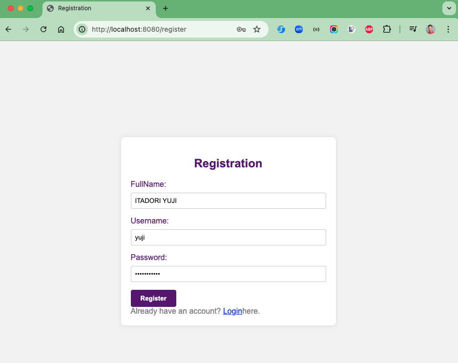
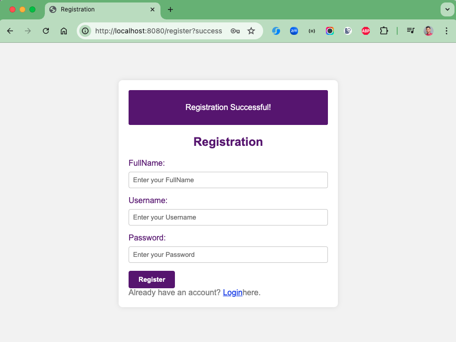
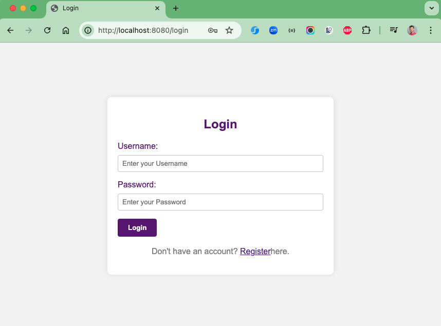
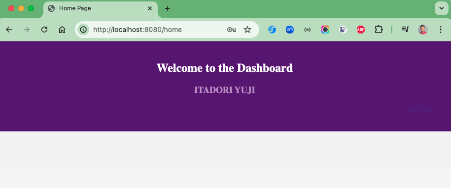

# spring-boot-registration-demo

### Things todo list

1. Clone this repository: `git clone https://github.com/hendisantika/spring-boot-registration-demo.git`
2. Navigate to the folder: `cd spring-boot-registration-demo`
3. Make sure change your DB credentials in `application.properties`
4. Run the application: `mvn clean spring-boot:run`
5. Open your favorite browser: http://localhost:8080/register

### Image Screenshot

Register Page

Login Page

Home Page

